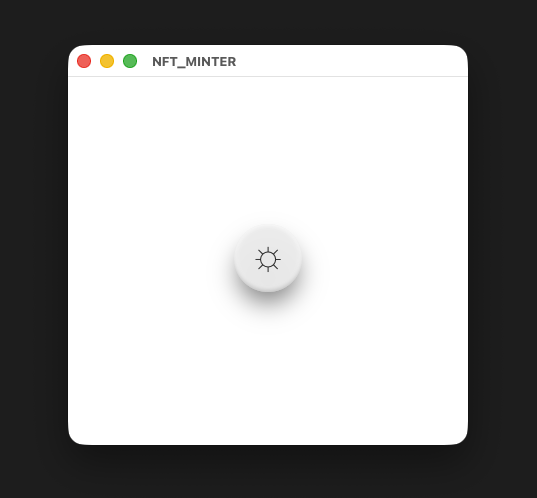

# NFT MINTER

A user-friendly desktop + browser application designed to seamlessly mint NFTs!

## Getting Started

### Prerequisites

* Install modules
  ```sh
  brew install nvm
  ```
* Install a wallet desktop app (currently, only MetaMask is supported!)
* Compile & deploy your desired smart contract, taking note of the ABI and address
  
### Installation

1. Clone the repo
   ```sh
   git clone https://github.com/toov00/NFT_MINTER.git
   ```
2. Install NPM packages
   ```sh
   npm install
   ```
3. Enter your smart contract's ABI in `config.js`
   ```js
   const ABI = 'ENTER ABI';
   ```
4. Enter your smart contract's ADDRESS in `config.js`
   ```js
   const ADDRESS = 'ENTER ADDRESS';
   ```

## Usage

1. Run the React and Electron services
   ```sh
   npm run dev
   ```
2. Click the button in the pop-up to connect your wallet and start minting your NFT!
   

## Roadmap

- [x] Add Usage details
- [ ] Reframe as Chrome Extension
